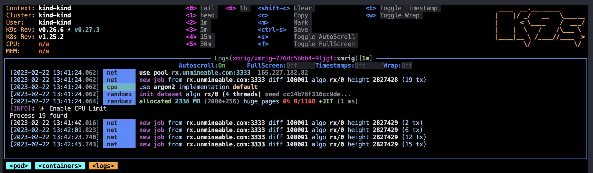
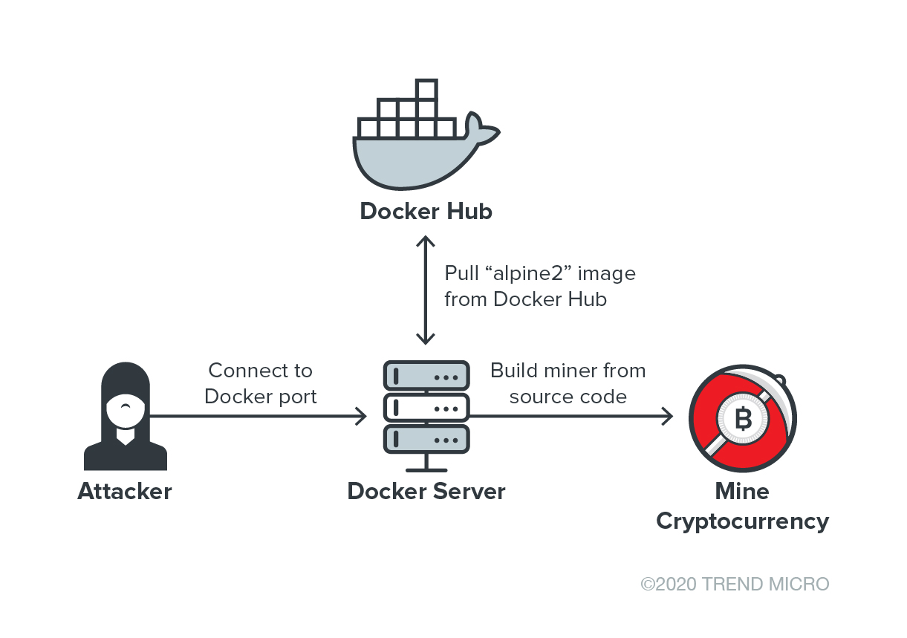

<!-- BEGIN_TF_DOCS -->
<div align="center">

<a name="readme-top"></a>


<h2>Docker Crypto Miner</h2>

[]()
[]()
[]()

---


<p>A containerized solution for mining crypto using <a href=https://github.com/xmrig/xmrig>XMRig</a> miner</p>

<p>
  <a href="#-description-">Description</a>&nbsp;&nbsp;&nbsp;|&nbsp;&nbsp;&nbsp;
  <a href="#-getting-started-">Getting Started</a>&nbsp;&nbsp;&nbsp;|&nbsp;&nbsp;&nbsp;
  <a href="#-concepts-">Concepts</a>&nbsp;&nbsp;&nbsp;|&nbsp;&nbsp;&nbsp;
  <a href="#-links-">Links</a>&nbsp;&nbsp;&nbsp;|&nbsp;&nbsp;&nbsp;
  <a href="#-donations-">Donations</a>&nbsp;&nbsp;&nbsp;|&nbsp;&nbsp;&nbsp;
  <a href="#-versioning-">Versioning</a>&nbsp;&nbsp;&nbsp;|&nbsp;&nbsp;&nbsp;
  <a href="#-troubleshooting-">Troubleshooting</a>
</p>

</div>

---

## ➤ Important Note <a name="#-important-node"></a>

**🚨 This repository is intended for educational and ethical purposes. Please note that the creators cannot be held responsible for any misuse by individuals. However, we encourage you to use this resource at your own risk.**

**🚨 Before mining in the cloud or using private equipment or an on-site data center, we recommend that you carefully review your provider's terms and conditions.**

<p align="right">(<a href="#readme-top">back to top</a>)</p>

## ➤ Description <a name="#-description"></a>

This repository contains a containerized setup of the xmrig tool, which allows you to go from zero to mining in about 5 minutes on any architecture running containers.

CPU mining can be profitable using algorithms such as: `RandomX`, `Cryptonight` or `Equihash`. Learn more about profitability [here](https://www.nicehash.com/profitability-calculator).

<p align="right">(<a href="#readme-top">back to top</a>)</p>

## ➤ Getting Started <a name="#-getting-started"></a>

### Setup

To configure your system for the development of this project, follow the steps below:

- Install [asdf](https://asdf-vm.com/) to manage runtime dependencies.
- Install runtime dependencies.

```bash
cut -d' ' -f1 .tool-versions | xargs -I{} sh -c 'asdf plugin add "$1"' -- {}
asdf install
```

- Run task from the root of the repository to see available commands. We use task in place of make for this project. See [Taskfile.yml](Taskfile.yml) for more information.

### Variables

The preferred way to configure XMRig is using a configuration file in JSON format, because it is more flexible and easier to use. The CLI doesn't cover all the features available and can be a limiting factor, depending on the scenario.

| Name                  | Description                   |
|-------------------    |-----------------------------  |
| MINING_POOL           | URL of mining server          |
| MINING_COIN           | Coin to mining                |
| REFERRAL_CODE         | Param to educe mining rater   |
| WALLET_ADDRESS        | Wallet address                |
| WORKER_NAME           | Worker name                   |
| XMRIG_CONFIG_FILE     | XMRig config file reference   |

### Running

**Docker**

<details>
<summary>Container</summary>
<p>

Just a simple example that you can use to run this container:

```bash
docker container run \
  --restart unless-stopped --name crypto-miner -d \
  -e MINING_POOL="rx.unmineable.com:3333" \
  -e MINING_COIN="SHIB" \
  -e REFERRAL_CODE="7lkr-kmhq" \
  -e WALLET_ADDRESS="<your-wallet-address>" \
  -e WORKER_NAME="docker-mining" \
  ghcr.io/lpsm-dev/docker-crypto-miner:main
```

Click [here](https://github.com/lpsm-dev/docker-crypto-miner/pkgs/container/docker-crypto-miner/versions) to see available image tags.
</p>
</details>

<details>
<summary>Logs</summary>
<p>

Shows information logged of the running container:

```bash
docker logs -f crypto-miner
```

or

```bash
docker logs --tail 1000 crypto-miner
```
</p>
</details>


**Kubernetes**

<details>
<summary>Pods</summary>
<p>

<div align="center">



</div>

For more information [here](./infra/README.md).
</p>
</details>

<p align="right">(<a href="#readme-top">back to top</a>)</p>

## ➤ Concepts

This section aims to describe at a high level which tools we use and how we use them, without reproducing documentation that is better written (and more up-to-date) in the repositories and websites of the tools themselves. It is recommended that you familiarize yourself with these tools as soon as possible.

### XMRig

Basically, XMRig is a free, open-source mining program. It can be installed on Windows, Linux and macOS, and allows you to mine using the RandomX algorithm. Here's a brief example of the run command:

```bash
xmrig.exe -o rx.unmineable.com:3333 -a rx -k -u COIN:YOUR_ADDRESS.WORKER_NAME#REFERRAL_CODE -p x pause
```

- **COIN**: it's the coin that you're extracting, for example: **ADA**, **TRX**, **WIN** or more. Also, keep the `:` symbol between the currency and your address.
- **YOUR_ADDRESS**: must be a valid address for the currency you choose, otherwise the pool will return an error, also be sure to check the supported network for some currencies like TRC20 for USDT mining (TRON address).
- **WORKER_NAME**: it's any name that you would like to define for your worker.
- **REFERRAL_CODE**: it's the parameter used to reduce the mining rate.

### Unmineable

Unmineable is a mining pool that allows anyone to become a miner using a personal computer.

### ASIC

The acronym ASIC describes a series of computer devices designed from start to finish to provide maximum performance in cryptocurrency mining tasks.

### RandomX

RandomX is a proof-of-work (PoW) algorithm that is optimized for general-purpose CPUs. RandomX uses random code execution (hence the name) along with various hard memory techniques to minimize the efficiency advantage of specialized hardware.

### Mining Rig

A mining rig is a mining platform. The rig can be a dedicated miner, where it has been bought, built and operated specifically for mining, or it can be a computer that fulfills other needs, such as a gaming system, and is used to mine only part-time.

### CPU Limit

Cpulimit is a tool that allows us to limit CPU usage by process. It gives us a few ways to identify the desired process, either by process name, PID or executable path. It's useful for controlling batch tasks when you don't want them to consume too many CPU cycles. The aim is to prevent a process from running for more than a certain amount of time. It is also able to adapt to the overall system load dynamically and quickly.

### Security

<div align="center">



</div>

Pay attention to the images you use for these purposes and protect yourself against cryptojacking. Containers have become frequent targets for threat actors carrying out malicious cryptocurrency mining and other attacks. Last year, Trend Micro came across activities by cryptocurrency miners that were implemented as rogue containers using a community-distributed image published on Docker Hub. In May, researchers found an open directory that contained a malicious cryptocurrency miner and a distributed denial of service (DDoS) bot that targeted open Docker daemon ports. In the attack, an Alpine Linux container was created to host the cryptocurrency miner and the DDoS bot.

<p align="right">(<a href="#readme-top">back to top</a>)</p>

## ➤ Links

- [XMRig configuration wizard](https://xmrig.com/wizard)
- [Unmineable](https://unmineable.com)
- [Profit Calculator](https://www.coincalculators.io)
- [Optimize CPU minning performance](https://www.nicehash.com/blog/post/how-to-optimize-cpu-mining-performance-for-monero-random-x)
- [Mining Reward Estimates](https://www.coinwarz.com)
- [Explain RandomX algorithm](https://academy.bit2me.com/en/which-mining-algorithm-randomx-monero)
- [What is ASIC?](https://academy.bit2me.com/pt/quem-s%C3%A3o-mineiros-asic)
- [Cloud Vultr](https://www.vultr.com)

<p align="right">(<a href="#readme-top">back to top</a>)</p>

## ➤ Donations

If my work has had a positive impact on your life and you want to buy me a coffee (or a hundred), you'll be very grateful!

<a href="https://www.blockchain.com/pt/btc/address/bc1qhfnh66d2wnveg3s932dz4gtmdqljrj67hs7hta">
  
</a>

<p align="right">(<a href="#readme-top">back to top</a>)</p>

## ➤ Versioning <a name="#-versioning"></a>

To check the change history, please access the [**CHANGELOG.md**](CHANGELOG.md) file.

<p align="right">(<a href="#readme-top">back to top</a>)</p>

## ➤ Troubleshooting <a name="#-troubleshooting"></a>

If you have any problems, [open an issue in this project](https://github.com/lpsm-dev/docker-crypto-miner/issues).

<p align="right">(<a href="#readme-top">back to top</a>)</p>

## ➤ Show your support <a name="-show-your-support"></a>

<div align="center">

Give me a ⭐️ if this project helped you!


Made with 💜 by [me](https://github.com/lpsm-dev) 👋 inspired on [readme-md-generator](https://github.com/kefranabg/readme-md-generator)

</div>

<p align="right">(<a href="#readme-top">back to top</a>)</p>
<!-- END_TF_DOCS -->
